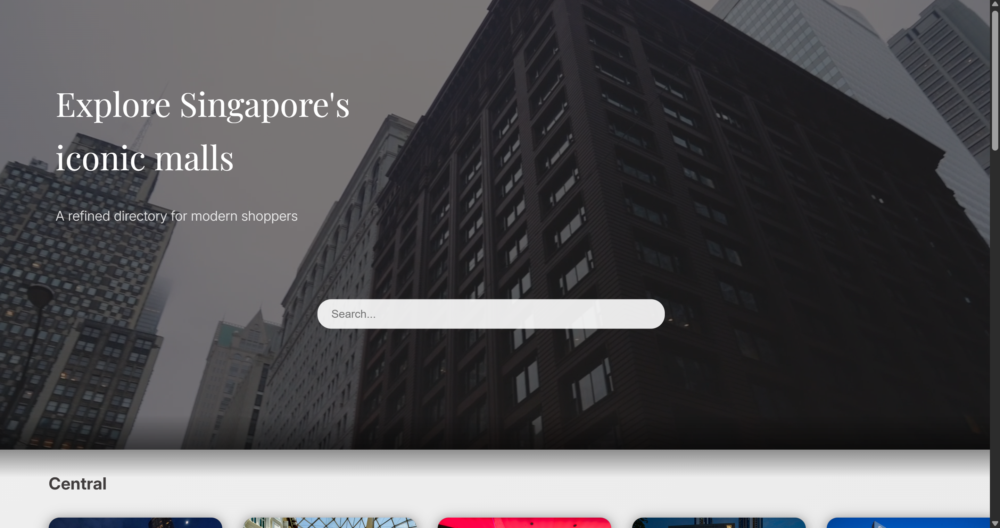
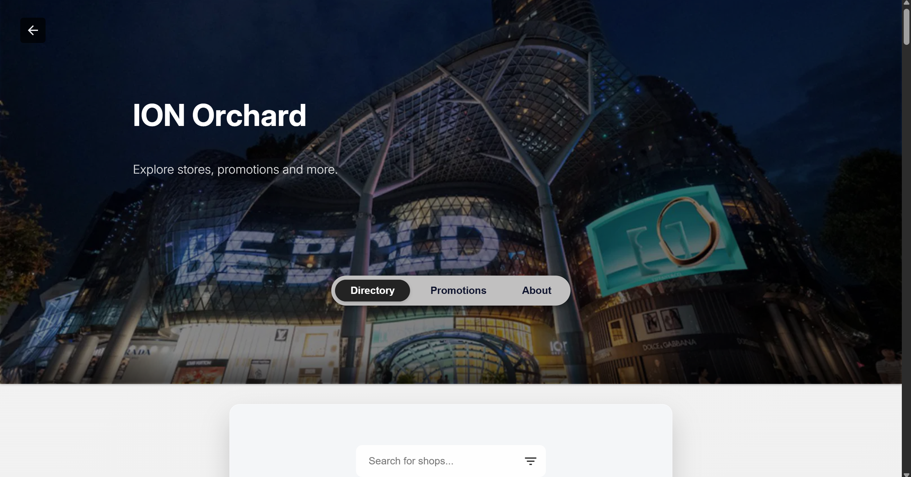

# 🛍️ SingSplore

**SingSplore** is a responsive mall directory web app for exploring Singapore’s shopping malls. The website provides information like a store directory, current ongoing promotions and an about tab.

> This is my **first solo web project** done outside of school 😊 I started this due to the fact that many directory websites had lackluster UI/UX and outdated information:  
> Most mall websites in Singapore either look outdated, are inconsistent, or lack basic features like filtering or search which gave me a poor user experience as a local.  
>
> So I built **SingSplore** to fix that clean modern UI, real-time search filtering, and smooth mobile browsing, all coded from scratch using HTML, CSS, and JavaScript.

## Ongoing Work & Future Plans

One of the biggest challenges in building SingSplore has been the **manual process of data entry**, especially for store directories and promotions across over 170 malls in Singapore.

As a solo developer, I realized this approach isn’t scalable. So instead of manually inputting every mall’s data, I’ve started planning a **second project**: a tool that automates the data collection process from public mall websites.

---

## Built for Scalability

The site is designed to scale smoothly:

- All malls, shops, and promotions are generated **dynamically** from structured data
- Adding a new mall only requires updating the `mallData.js` file — no need to write new HTML
- Search, filtering, and layout adapt automatically based on available data

The only current bottleneck is the time it takes to gather and format that data.

## 🔗 Live Demo

🏢[Visit SingSplore on Netlify](https://singsplore.netlify.app/)

---

## ✨ Features

- 🔍 Real-time search with live filtering for Shopping Malls and the Malls directory
- 🔍 Dynamic filtering using a filter chip modal UI for stores
- 🧭 Region-based Swiper navigation using Swiper.js
- 🛒  2 Malls (currently) with Full shop listings with logos, floors, and categories 
- 🎉 Promotions tab with shop name & validity date
- 🎥 Hero video with a loading placeholder to make the website feel more luxurious
- 📍 Google Maps integration for directions
- 📱 Mobile-responsive design
- Scalable design
---

## 🧱 Tech Stack

- **HTML5**, **CSS3**
- **Vanilla JavaScript**
- **Swiper.js** (for sliders)
- **Netlify** (for deployment)
- **GitHub** (version control)

---

## Screenshots

### Homepage

### Focused mall

